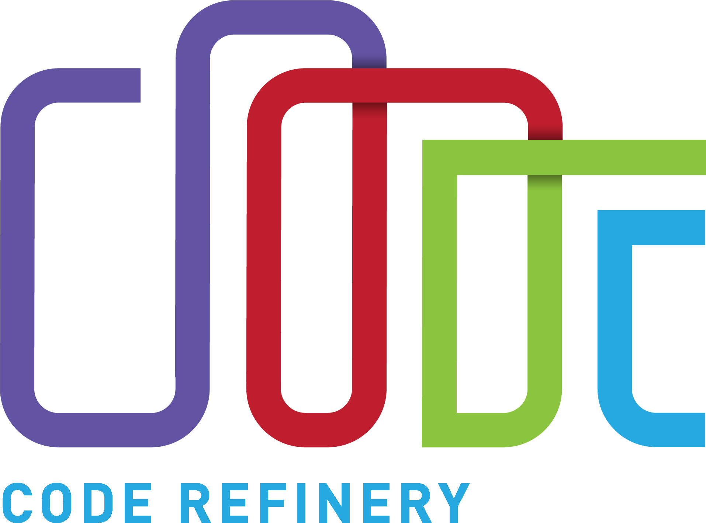
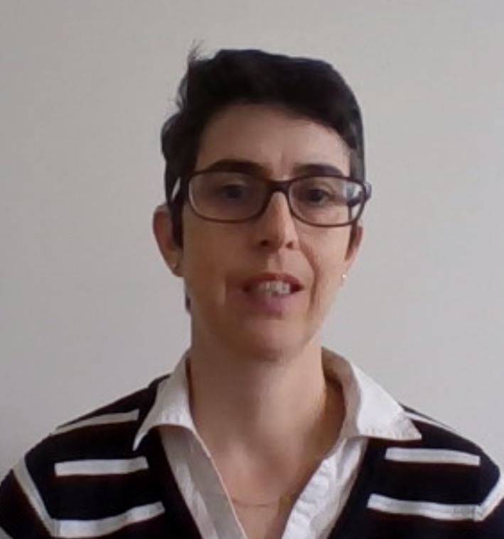

class: center, middle, inverse

# An online workshop about organizing online workshops

### Radovan Bast, Richard Darst, Anne Fouilloux

<!-- briefly introduce authors and say who is presenting -->

---

## We will talk about lessons learned from teaching a number of online workshops

- [Blog post](https://coderefinery.org/blog/2020/07/31/mega-coderefinery/)
- [Presentation at CarpentryCon 2020](https://2020.carpentrycon.org/schedule/#session-32)
- [Slides of the CarpentryCon 2020 talk](https://cicero.xyz/v3/remark/0.14.0/github.com/coderefinery/carpentrycon-2020/master/slides.md/)

## Presenters at CarpentryCon 2020

---

## Introduction to the session

### House keeping
 - Questions about the contents -> HackMD
 - Questions about technical stuff -> Zoom Chat

### Contents (20 min)
 - What is CodeRefinery?
 - A vision of reaching many people at once
 - How we did it
 - Role presentations
 - Future outlook and discussion

---

## CodeRefinery: project and funding

- Funded 2016-2021 by [Nordic e-Infrastructure Collaboration (NeIC)](https://neic.no/)
- Co-funding by Sigma2 (Norway), SNIC (Sweden), DeiC (Denmark), CSC (Finland), ETAIS (Estonia)
- Important hubs: NTNU Trondheim, University of Oslo, KTH Stockholm, Aalto University
- Over 1400 persons trained
- Since March 2020 we have organized 15 events

### [Map of past workshop/events](https://coderefinery.org/workshops/past/)

---

## CodeRefinery: audience and lessons

Our **learners are not pure beginners**, they already develop code but want to
become better at **collaboration and reproducibility**

### Typical workshop

- Introduction to version control
- Collaborative distributed version control
- Reproducible research and FAIR data
- Social coding and open software
- Documentation
- Jupyter
- Automated testing
- Modular code development

### More lessons

https://coderefinery.org/lessons/

---

## A vision of reaching many people at once

--

---

## A vision of reaching many people at once

- Our previous workshops were in-person and not very large (~25 learners)
- The promise of technology is to be able to reach huge numbers of
  people at once.  But is that too impersonal?
- Surely we must be able to get the best of best worlds...
- With a consistent vision, yes, you can reach many people.  But it
  requires that vision from the start, and everything supporting that
  value.

---

class: center, middle, inverse

# How we did it

### Lectures & code-along exercises in the main room

### Get help and group exercises in a breakout room

### Bring your own breakout room

## And effective team work!

---

## Don't complain about being online

- Is it a disaster or an opportunity?
- Don't even think of the same as before, but adapt to particular
  advantages.
- Invest in the tools, since we'll be using them more and more.

---

## Main room: Lectures & code-along exercises
<!-- Anne -->
- Short lectures to explain a concept, and "asynchronous Q&A" in the main room
- Demonstrate it on a very short example (and often repeat explanation)
- Mass feedback tools:
	- surveys with simple (yes/no) questions
	- check speed with faster/slower buttons
	- ask a question and learners write down answers in HackMD
	- ask learners to contribute to discussion via HackMD
- Sometimes make a code-along exercise and always repeat similar exercise in breakout rooms

*Move on when about 70% have answered, so delegate potential misunderstanding to helpers during group exercises.*

---

## Breakout rooms: Get help and group exercises

You can't have a community of 100 or 30 or ever 10 people: push
community to breakout rooms

- Pre-defined and fixed breakout rooms with **4 to 6 people + helper**
  in each:
- Helpers often "taught" again to clarify concept
- **Teams**: Learners could register as a team (3-10 persons) with a
  designated helper:
	- Registration form included a “team name”
- Manage with zoom: Zoom name = “(5) Richard Darst” or “(5,H) Richard Darst”

*This is how we effectively scaled...*

---

## Helpers

.left-column[
- We want one helper per breakout room if at all possible

- [Helper
  training](https://coderefinery.github.io/manuals/helping-and-teaching/)
  [(2)](https://coderefinery.github.io/manuals/breakout-rooms-helping/)
  is short but important.
- Expert helpers: stand-by instructors or experts, rotate around
  breakout rooms/watch HackMD/relay questions

]

.right-column[

]

*This is how we get new people involved in the project: next
generation of instructors?*

---

## Asynchronous Q&A, HackMD

- You can't scale Q&A to many people
  - Does verbal Q&A even work for shy people in classrooms?

- Meeting chat scrolls too fast, not suitable for questions

- Solution: **Collaborative notes for Q&A**
  - Ask in bullet point, reply in others
  - Dedicated people watching, answering, and asking questions by voice

- Beware: warn learners of information overload

---

## Explain how to participate

- It's obvious how to attend a lecture (or is it?)
- But people don't yet know how to attend a course online.
  - Focus, don't be distracted.  What to focus on.
  - Screen layout
  - How to use tools, layout screen

- Opportunity for **multiple channels of communication**
  - Voice + HackMD: allows catch-up
  - But prevent information overload!

- "Mandatory" install help and verification time

---

## Other things you can do

- Always ask for feedback after every session (HackMD)
- Explain how to participate
- Recording: allows instant replay/catching up after workshop
- Streaming: separate learners from instructors, anyone can watch.
- **Breaks**: non-negotiable, minimum 10 min/hour.

*Once you do it right, you might not go back!*

---

# Role presentations

.left-column-70[
1. Learner
2. Helper
3. Helper on a team
4. Expert helper
5. Instructor
6. Zoom host
7. HackMD host
]

---
# Role presentations

.left-column-30[
1. **Learner**
2. Helper
3. Helper on a team
4. Expert helper
5. Instructor
6. Zoom host
7. HackMD host
]

.right-column-70[
- **Petri Jehkonen**, Master student at Aalto University
- **Background** - SW (C, Assembly) for embedded solutions
- **Expectation** - Git (only)
- Workshop arrangements from beginning to end were well managed
- Challenges for learner
- Outcome - Much more than Git
]

---
# Role presentations

.left-column-30[
1. Learner
2. **Helper**
3. Helper on a team
4. Expert helper
5. Instructor
6. Zoom host
7. HackMD host
]

.right-column-70[
- **Matúš Kalaš**, University of Bergen (Norway)
<!-- If you're asking whether you can be a helper, you most likely can! -->
- Assigned a **breakout room**
<!-- Semi-stable breakout room assignment, with minimum changes of the "assigned" learners -->
- Leads exercise work in their room, or just **helps the learners** therein and answers their questions
<!-- incl. indexing where we are / what we are doing, asking how it goes, etc. -->
<!-- "My" learners mostly preferred to work alone first & then ask questions if needed. Occasionally someone sharing their screen -->
- **Forwards** interesting questions and difficult problems to HackMD or expert helpers
- Depending on confidence with the exercises, needs only **minimum preparation**  
<!-- <small>(So awesome that instructors prepared everything so well!)</small> -->
<!-- Preparation as a helper recommended, but most of the time (would have) worked also without. I skipped preparation in one exercise (about what I do every day), and I managed to mess it up quite a bit :DD  All other exercises were smooth though. -->
- If 2 screens or fast in switching, a helper may help **answering** in HackMD and Zoom chat  
<!-- <small>(There are also optional advanced exercises, and  advanced topics to discuss in HackMD)</small> -->
<!-- If without an extra screen (recommended but not mandatory), I personally wouldn't have been able to follow hackMD, and chat also not so much. But the helper work would still function just fine. -->
- **Learns** a lot, feels useful, and has a lot of **fun** ;D
<!-- Much more fun to go through the teaching material as a helper than just following it alone (and to experience the whole workshop in its interactivity and excitement!) -->
<!-- Some improvement possibilities:
	- more explicit about suggested layouts of screen(s) for learners, possibly specific to a given lecture or exercise (also presenters taking that into account for their screen)
	- more explicit when & what helpers should prepare
-->
]
---
# Role presentations

.left-column-30[
1. Learner
2. Helper
3. **Helper on a team**
4. Expert helper
5. Instructor
6. Zoom host
7. HackMD host
]

.right-column-70[
- **Samantha Wittke**, PhD student at Aalto University and Researcher at Finnish Geospatial Research Institute (FGI)
- **Helper on a team** from FGI
- Myself: in-person workshop **learner one year ago**
- **Lower barrier** to interact/ask questions
- Explaining topics **work-related**
- **Easy to get lost** in course-unrelated topics
]

---
# Role presentations

.left-column-30[
1. Learner
2. Helper
3. Helper on a team
4. **Expert helper**
5. Instructor
6. Zoom host
7. HackMD host
]

.right-column-70[
- **Radovan Bast**, University of Tromsø (Norway)
- **Knows the material well**
- Cycles through breakout rooms to see how it is going
  - **Ensure helpers are doing OK**
  - **Encourage** discussion
  - **Encourage** learners to share screen in breakout rooms
  - Provide advice when needed
- Can call other helpers via HackMD/chat
]

---
# Role presentations

.left-column-30[
1. Learner
2. Helper
3. Helper on a team
4. Expert helper
5. **Instructor**
6. Zoom host
7. HackMD host
]

.right-column-70[
- **Anne Fouilloux**, Research Software Engineer at the University (Norway)
- Taught from home with one screen (laptop)
- **Less pressure** and **easier** to focus on the teaching
- **Get feedback** from your team
- Get frequent, **interactive assessments** of learners' progress
- **Tell your learners** when code-along or demos
- Useful to be instructor and expert helper during the workshop
]

---
# Role presentations

.left-column-30[
1. Learner
2. Helper
3. Helper on a team
4. Expert helper
5. Instructor
6. **Zoom host**
7. HackMD host
]

.right-column-70[
- **Naoe Tatara**, University of Oslo Science Library, Digital Scholarship Center
- **Dedicated for Zoom room management**, including recording and streaming
	- Zoom-participant control <!-- entry approval and co-host assignment -->
	- Communication with participants <!-- mainly via Zoom chat for practical things -->
	- Breakout room management <!-- assignment, timing, disabling/enabling waiting room, flexibility and consistency -->
- Important to **pay attention to multiple communication channels**
- Details on [our blog post](https://coderefinery.org/blog/2020/07/31/mega-coderefinery/)
]

---
# Role presentations

.left-column-30[
1. Learner
2. Helper
3. Helper on a team
4. Expert helper
5. Instructor
6. Zoom host
7. **HackMD host**
]

.right-column-70[
- **Richard Darst**, Aalto Scientific Computing, Aalto University (Finland)
- Focus on **monitoring the HackMD**
  - Everyone can answer questions, but at least one person
    always dedicated to it.
- **Answer questions**
- **Bring up important questions to the instructor**
- **Organize/comment** on complicated answers
- Add links and "meta-information" about where we are
- Ensure consistent formatting, **prepares it for publication**
]

---

class: center, middle, inverse

## Future outlook and Q&A session

---

## Future outlook and Q&A session

<!-- RB, 10 minutes, q&a and "discussion" via hackmd -->

- Continue with online workshops - not replacement to
  in-person workshops but complementary.
- Advantages: more reach, cheaper to participate, possible to
  involve remote helpers.
- Do larger online-workshops and streaming work for all audience types?
  (diversity, tech background, network bandwidth)
- Encourage and accept observers/[lurkers](https://en.wikipedia.org/wiki/Lurker)
  more (better experience when streaming).
- How to encourage participation and protect privacy while streaming/recording?
- How can we make a federated model via the stream? We don't know yet.

### Join us: [coderefinery.org](https://coderefinery.org/), [@coderefine](https://twitter.com/coderefine), [coderefinery.zulipchat.com](https://coderefinery.zulipchat.com/)
